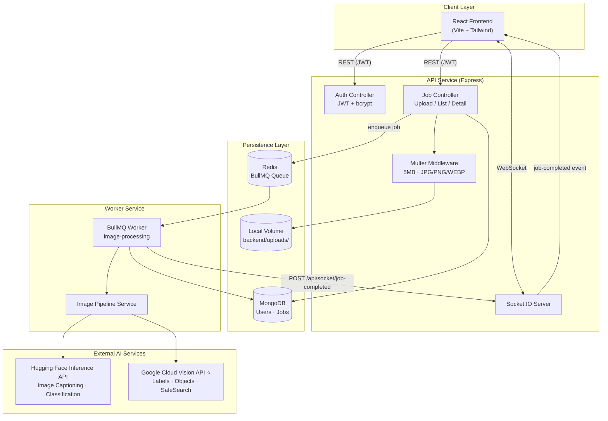
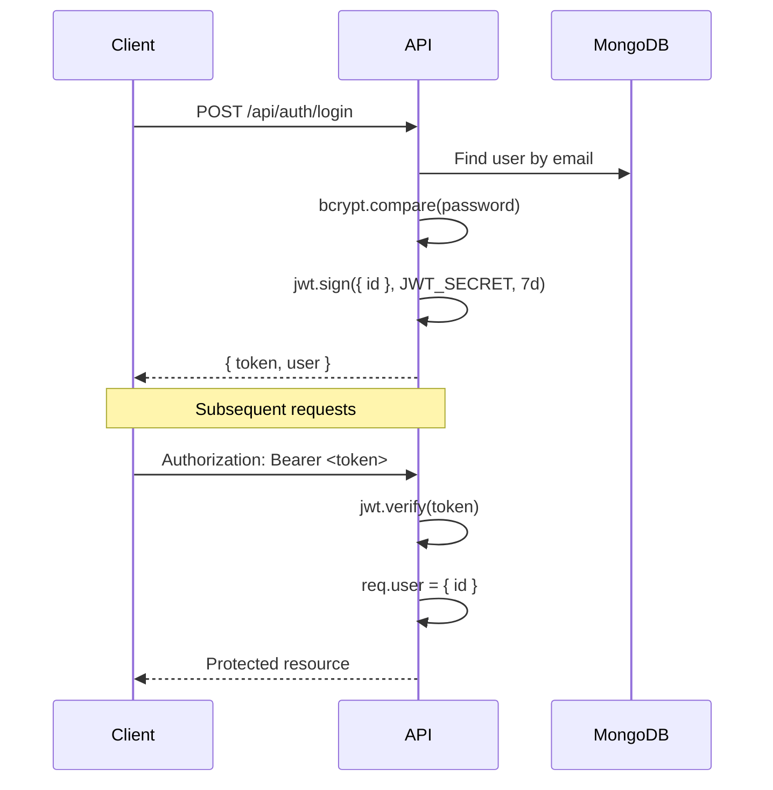
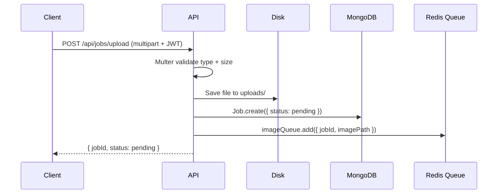
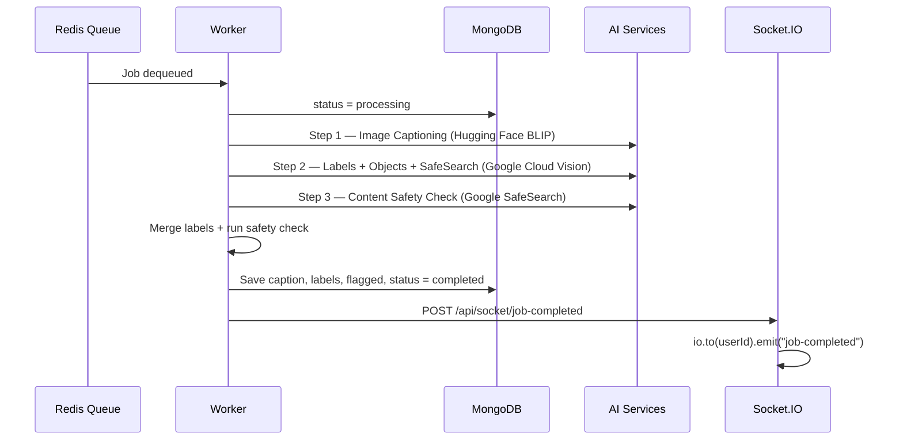
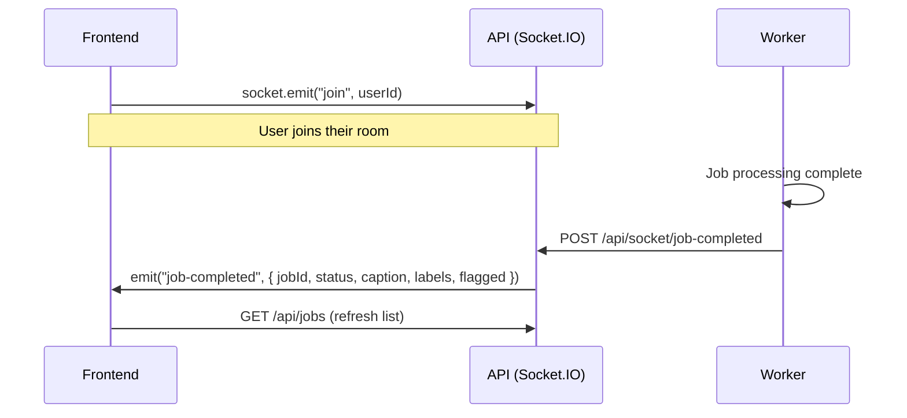

# AI-Powered Media Processing Microservice

A full-stack microservice that accepts user-uploaded images, processes them asynchronously through an AI pipeline, and returns enriched metadata (caption, labels, safety classification). Built as the backend infrastructure for a content platform where users upload images and the platform extracts structured metadata automatically — without blocking the user.

**Repository:** [github.com/raunaque21278/Image_categorization](https://github.com/raunaque21278/Image_categorization)

> ### Google Cloud Vision API — Important Note
>
> **Google Cloud Vision API** is the primary AI service for **label detection**, **object localization**, and **content safety (SafeSearch)** in this project. The integration is implemented correctly in `worker/services/visionService.js` — **there is no code issue**.
>
> Google Cloud requires a **billing account with prepayment enabled** before the Vision API will process requests in production. Until billing is activated on your GCP project, API calls may fail or return empty results. Once prepayment billing is set up and the Cloud Vision API is enabled, the pipeline works as designed with no code changes required.

---

## Table of Contents

1. [Overview](#overview)
2. [Features](#features)
3. [Architecture Diagram (HLD)](#architecture-diagram-hld)
4. [High Level Design (HLD)](#high-level-design-hld)
5. [Low Level Design (LLD)](#low-level-design-lld)
6. [AI Processing Pipeline](#ai-processing-pipeline)
7. [Tech Stack](#tech-stack)
8. [Project Structure](#project-structure)
9. [API Endpoints](#api-endpoints)
10. [Docker — Run the Full Stack](#docker--run-the-full-stack)
11. [Environment Variables](#environment-variables)
12. [Design Decisions & Assumptions](#design-decisions--assumptions)
13. [Real-Time Job Updates](#real-time-job-updates)
14. [Flagged Content Handling](#flagged-content-handling)
15. [Scalability Considerations](#scalability-considerations)
16. [Known Limitations](#known-limitations)

---

## Overview

When a user uploads an image, the system:

1. **Stores** the file durably on disk
2. **Creates** a job record in MongoDB with status `pending`
3. **Enqueues** the job into a Redis-backed BullMQ queue
4. **Returns** the job ID immediately (non-blocking)
5. **Processes** the image in a separate worker service via three sequential AI tasks
6. **Enriches** the job with results and makes them queryable via REST API
7. **Notifies** the frontend in real time when processing completes

---

## Features

| Requirement | Implementation |
|---|---|
| User sign up / log in | JWT-based auth with bcrypt password hashing |
| Authenticated endpoints | Bearer token middleware on all job routes |
| Image upload (JPG, PNG, WEBP) | Multer with MIME type filter |
| Max file size 5 MB | Enforced at API layer via Multer `limits` |
| Async processing | BullMQ queue + dedicated worker service |
| Job list with statuses | `GET /api/jobs` — pending, processing, completed, failed |
| Job detail view | `GET /api/jobs/:id` — caption, labels, safety flag |
| Retry failed jobs | `POST /api/retry/:id` controller (see [Known Limitations](#known-limitations)) |
| Flagged content surfacing | Distinct red styling + flagged count on dashboard |
| Real-time status updates | Socket.IO WebSockets (worker → API → client) |
| Frontend upload flow | Choose file → click **Upload** to start processing |
| Docker containerisation | `docker compose up --build` — API, worker, Redis, MongoDB, frontend |
| Postman collection | `postman collections/Postman Collections.postman_collection.json` |

---

## Architecture Diagram (HLD)



---

## High Level Design (HLD)

### System Components

| Component | Role | Technology |
|---|---|---|
| **Frontend** | Sign up, login, upload, job list, results view | React 19, Vite, Tailwind CSS, Socket.IO Client |
| **API Service** | HTTP gateway, auth, file upload, job CRUD, WebSocket hub | Node.js, Express 5 |
| **Worker Service** | Consumes queue jobs, runs AI pipeline, updates DB | Node.js, BullMQ Worker |
| **Message Queue** | Decouples upload from processing; enables retries | Redis + BullMQ |
| **Database** | Users, job state, AI results | MongoDB (Mongoose) |
| **File Storage** | Durable image storage | Local filesystem (`backend/uploads/`) |
| **AI Layer** | Caption, label detection, safety check | **Google Cloud Vision API** (primary), Hugging Face Inference API |

### Separation of Concerns

The system follows a **producer–consumer** pattern:

- **API Service (Producer):** Handles synchronous user requests only — authentication, validation, file persistence, job creation, and queue enqueue. Never calls AI APIs directly, so upload latency stays low.
- **Worker Service (Consumer):** Handles all CPU/IO-heavy and external API work. Scales independently from the API. Failures here do not crash the API.

### Data Flow

```
Upload Request
    → Validate auth + file type/size
    → Save file to disk
    → Create Job (status: pending) in MongoDB
    → Add job to Redis queue
    → Return { jobId, status: pending }

Worker picks job
    → Update status: processing
    → Run AI pipeline (caption → labels → safety)
    → Update Job with results (status: completed)
    → Emit WebSocket notification to user room
```

### Failure Handling

| Scenario | Behaviour |
|---|---|
| AI API timeout/error | Worker throws; BullMQ retries up to 3 times with exponential backoff (3 s base) |
| All retries exhausted | Job status set to `failed`; `errorMessage` stored |
| Manual retry | User triggers re-queue via retry endpoint; status reset to `pending` |
| Socket notification failure | Logged; job still marked completed in DB |

### State Management

Job lifecycle states: `pending` → `processing` → `completed` | `failed`

MongoDB is the **source of truth** for job state. Redis/BullMQ holds transient queue metadata only. Both API and Worker connect to the same MongoDB instance.

---

## Low Level Design (LLD)

### Database Schema

#### User Collection

```
User {
  _id:        ObjectId
  name:       String (required)
  email:      String (required, unique)
  password:   String (required, bcrypt hashed)
  createdAt:  Date
  updatedAt:  Date
}
```

#### Job Collection

```
Job {
  _id:              ObjectId
  userId:             ObjectId → User (required)
  imageUrl:           String   — relative path e.g. "uploads/1234.jpg"
  status:             Enum     — pending | processing | completed | failed
  caption:            String
  labels:             [String]
  flagged:            Boolean  — default false
  flaggedCategory:    String
  queueJobId:         String
  retryCount:         Number   — default 0
  errorMessage:       String
  createdAt:          Date
  updatedAt:          Date
}
```

### API Service — Module Breakdown

```
backend/src/
├── server.js              # Express app + HTTP server + Socket.IO init
├── config/
│   ├── db.js              # Mongoose connection
│   └── redis.js           # IORedis connection for BullMQ
├── middleware/
│   ├── auth.js            # JWT Bearer token verification
│   └── upload.js          # Multer: disk storage, MIME filter, 5 MB limit
├── models/
│   ├── User.js
│   └── Job.js
├── controllers/
│   ├── authController.js  # signup, login, getMe
│   ├── jobController.js   # uploadImage, getJobs, getJobById
│   └── retryController.js # retryJob
├── routes/
│   ├── authRoutes.js      # /api/auth/*
│   ├── jobRoutes.js       # /api/jobs/*
│   ├── retryRoutes.js     # /api/retry/*
│   └── socketRoutes.js    # /api/socket/job-completed (internal)
├── queue/
│   └── imageQueue.js      # BullMQ Queue("image-processing")
└── sockets/
    └── socket.js          # Socket.IO: join user rooms, emit events
```

### Worker Service — Module Breakdown

```
worker/
├── worker.js                    # BullMQ Worker bootstrap + failure handler
├── workers/
│   └── imageWorker.js           # Job handler: status updates + pipeline call
├── services/
│   ├── imagePipelineService.js  # Orchestrates all 3 AI steps
│   ├── captionService.js        # Hugging Face BLIP image captioning
│   ├── classificationService.js # Hugging Face ViT classification
│   ├── visionService.js         # ⭐ Google Cloud Vision (labels, objects, SafeSearch)
│   ├── safetyService.js         # Keyword-based safety flagging
│   └── socketNotifier.js        # HTTP callback to API for WebSocket emit
├── repositories/
│   └── jobRepository.js         # findById, save abstraction
├── models/
│   └── Job.js                   # Shared schema with API
└── config/
    ├── db.js
    ├── redis.js
    └── safetyKeywords.js        # Unsafe label keyword list
```

### Authentication Flow (JWT)



**Why JWT?** Stateless, horizontally scalable, no server-side session store needed. Suitable for a microservice where the API may run multiple instances behind a load balancer.

### Upload Flow



### Worker Processing Flow



### Queue Configuration

```javascript
// Enqueue options (jobController.js)
{
  attempts: 3,
  backoff: { type: "exponential", delay: 3000 }
}
```

Queue name: `image-processing`  
Job name: `process-image`  
Payload: `{ jobId, userId, imagePath }`

---

## AI Processing Pipeline

Every image runs through three sequential AI tasks as specified in the requirements:

| Step | Task | Service | Model / API | Output |
|---|---|---|---|---|
| 1 | Image Captioning | `captionService.js` | Hugging Face — `Salesforce/blip-image-captioning-base` | Natural language description |
| 2 | Object / Label Detection | `classificationService.js` + `visionService.js` | Hugging Face `google/vit-base-patch16-224` + **Google Cloud Vision** (LABEL_DETECTION, OBJECT_LOCALIZATION) | Merged unique label list |
| 3 | Content Safety Check | `safetyService.js` + `visionService.js` | **Google Cloud Vision SafeSearch** + label keyword matching | `flagged: true/false`, `flaggedCategory` |

### Google Cloud Vision API (Primary AI Service)

Google Cloud Vision powers the core enrichment and safety steps:

| Feature | Vision API Type | Used For |
|---|---|---|
| Label Detection | `LABEL_DETECTION` | Identifies objects, concepts, and scene labels |
| Object Localization | `OBJECT_LOCALIZATION` | Detects and names objects with bounding regions |
| Content Safety | `SAFE_SEARCH_DETECTION` | Flags adult, violent, racy, or medical content |

**Billing requirement:** Google Cloud Vision requires an active GCP project with **prepayment billing enabled**. The worker code in `visionService.js` is correct — if labels or SafeSearch results appear empty during testing, enable billing on your Google Cloud project. No application code changes are needed.

### Pipeline Orchestration (`imagePipelineService.js`)

```
1. classifyImage(imagePath)     → Hugging Face labels
2. analyzeImage(imagePath)      → ⭐ Google Cloud Vision: labels, objects, safeSearch
3. Merge all labels (deduplicated)
4. checkSafety(uniqueLabels)    → flagged + category (SafeSearch + keywords)
5. generateCaption(imagePath)   → Hugging Face BLIP caption (with label-based fallback)
6. Return { caption, labels, flagged, flaggedCategory, ... }
```

---

## Tech Stack

| Layer | Choice | Rationale |
|---|---|---|
| **Application** | MERN (MongoDB, Express, React, Node.js) | Required by spec; familiar full-stack pattern |
| **Queue** | Redis + BullMQ | Reliable job queue with built-in retry, backoff, and observability |
| **Containerisation** | Docker + Docker Compose | Full stack in one command; runs on any PC with Docker |
| **AI — Labels / Objects / Safety** | **Google Cloud Vision API** | Primary service per spec; label detection, object localization, SafeSearch. Requires GCP prepayment billing — no code issue |
| **AI — Captioning** | Hugging Face Inference API | `Salesforce/blip-image-captioning-base` for natural language captions |
| **AI — Classification** | Hugging Face Inference API | `google/vit-base-patch16-224`; supplements Vision labels |
| **File Storage** | Local volume (`backend/uploads/`) | Simple for development; swap to S3/GCS/R2 for production |
| **Auth** | JWT (Bearer token, 7-day expiry) | Stateless, scalable, no session store |
| **Real-time** | Socket.IO WebSockets | Push job completion to client without polling |
| **CI/CD** | GitHub (manual deploy) | Open-ended per spec |

---

## Project Structure

```
Image categorization/
├── backend/                 # API service
│   ├── src/
│   │   ├── server.js
│   │   ├── config/
│   │   ├── controllers/
│   │   ├── middleware/
│   │   ├── models/
│   │   ├── queue/
│   │   ├── routes/
│   │   └── sockets/
│   └── uploads/             # Stored image files
├── worker/                  # Background worker service
│   ├── worker.js
│   ├── workers/
│   ├── services/
│   ├── repositories/
│   ├── models/
│   └── config/
├── frontend/                # React SPA
│   └── src/
│       ├── pages/           # Login, Signup, Dashboard
│       ├── components/      # UploadForm, JobCard
│       ├── api/             # Axios client with JWT interceptor
│       └── socket/          # Socket.IO client
└── README.md
```

---

## API Endpoints

All job endpoints require `Authorization: Bearer <token>`.

### Authentication

| Method | Endpoint | Auth | Description |
|---|---|---|---|
| `POST` | `/api/auth/signup` | No | Register new user |
| `POST` | `/api/auth/login` | No | Login, returns JWT |
| `GET` | `/api/auth/me` | Yes | Get current user profile |

### Jobs

| Method | Endpoint | Auth | Description |
|---|---|---|---|
| `POST` | `/api/jobs/upload` | Yes | Upload image (field: `image`); returns `jobId` |
| `GET` | `/api/jobs` | Yes | List all jobs for authenticated user |
| `GET` | `/api/jobs/:id` | Yes | Get single job with full results |

### Retry

| Method | Endpoint | Auth | Description |
|---|---|---|---|
| `POST` | `/api/retry/:id` | Yes | Re-queue a failed job |

### Internal / Socket

| Method | Endpoint | Auth | Description |
|---|---|---|---|
| `POST` | `/api/socket/job-completed` | No | Worker → API callback to emit WebSocket event |

### Static Files

| Method | Endpoint | Description |
|---|---|---|
| `GET` | `/uploads/:filename` | Serve uploaded images |

---

## Docker — Run the Full Stack

Per the interview spec, the entire system runs in Docker with one command. No cloud deployment required — works on **your PC** or **any other machine** with Docker installed.

### Prerequisites

- [Docker Desktop](https://www.docker.com/products/docker-desktop/) (Windows / Mac) or Docker Engine (Linux)
- Google Cloud Vision JSON → save as `worker/config/google-vision.json`
- Hugging Face API token

### Quick start

```bash
# 1. Clone the repo
git clone https://github.com/raunaque21278/Image_categorization.git
cd Image_categorization

# 2. Create environment file
cp .env.docker.example .env
# Edit .env — set JWT_SECRET and HF_API_KEY

# 3. Add Google Vision credentials
# Place your GCP service account JSON at:
#   worker/config/google-vision.json

# 4. Start everything
docker compose up --build
```

First build may take **5–15 minutes**. When all containers are healthy, open:

| Service | URL |
|---|---|
| **Frontend** | http://localhost:3000 |
| **API** | http://localhost:5000 |
| **Health check** | http://localhost:5000/health |

Sign up → **Choose File** → click **Upload**.

### Docker containers

| Container | Image / build | Role |
|---|---|---|
| `media-frontend` | `frontend/Dockerfile` | React UI (nginx, port 3000) |
| `media-api` | `backend/Dockerfile` | Express API + Socket.IO (port 5000) |
| `media-worker` | `worker/Dockerfile` | BullMQ worker + AI pipeline |
| `media-mongo` | `mongo:7` | MongoDB database |
| `media-redis` | `redis:7-alpine` | BullMQ job queue |

Shared Docker volume `uploads-data` lets the API and worker access the same uploaded images.

### Useful Docker commands

```bash
# Run in background
docker compose up -d --build

# View logs
docker compose logs -f

# Check status
docker compose ps

# Stop all services
docker compose down

# Stop and remove volumes (fresh start)
docker compose down -v
```

### Run on another PC

1. Install Docker Desktop  
2. Clone this repo  
3. Copy `.env` and `worker/config/google-vision.json` (secrets — not in Git)  
4. Run `docker compose up --build`  

Same steps work on Windows, Mac, and Linux.

### Optional — run without Docker (manual)

<details>
<summary>Click to expand manual setup (Node.js + local MongoDB + Redis)</summary>

**Prerequisites:** Node.js 18+, MongoDB, Redis, API keys.

```bash
# Terminal 1 — MongoDB & Redis (or use local installs)
# Terminal 2 — API
cd backend && npm install && cp .env.example .env && npm run dev

# Terminal 3 — Worker
cd worker && npm install && cp .env.example .env && npm run dev

# Terminal 4 — Frontend
cd frontend && npm install && cp .env.example .env && npm run dev
```

Frontend: http://localhost:5173 | API: http://localhost:5000

</details>

---

## Environment Variables

### Backend (`backend/.env`)

Copy the example file and fill in your values:

```bash
cp backend/.env.example backend/.env
```

| Variable | Description | Example |
|---|---|---|
| `PORT` | API server port | `5000` |
| `MONGO_URI` | MongoDB connection string | `mongodb://localhost:27017/media-processing` |
| `JWT_SECRET` | Secret for signing JWT tokens | `your-secret-key` |
| `REDIS_HOST` | Redis hostname | `localhost` |
| `REDIS_PORT` | Redis port | `6379` |

### Worker (`worker/.env`)

Copy the example files and fill in your values:

```bash
cp worker/.env.example worker/.env
cp worker/config/google-vision.json.example worker/config/google-vision.json
```

Then edit `worker/.env` and replace `google-vision.json` with your real GCP service account key path and credentials.

| Variable | Description | Example |
|---|---|---|
| `MONGO_URI` | Same MongoDB as backend | `mongodb://localhost:27017/media-processing` |
| `REDIS_HOST` | Redis hostname | `localhost` |
| `REDIS_PORT` | Redis port | `6379` |
| `HF_API_KEY` | Hugging Face Inference API token (captioning + classification) | Get from [huggingface.co/settings/tokens](https://huggingface.co/settings/tokens) |
| `GOOGLE_APPLICATION_CREDENTIALS` | Path to GCP service account JSON | `./config/google-vision.json` |

### How to Obtain API Keys

#### Google Cloud Vision API (Required — Primary AI Service)

1. Create a project in [Google Cloud Console](https://console.cloud.google.com)
2. **Enable billing with prepayment** on the project — this is required for Vision API to process requests
3. Enable the **Cloud Vision API** under APIs & Services
4. Create a service account with **Cloud Vision API User** (or Editor) permissions
5. Download the JSON key file and save it as `worker/config/google-vision.json` (use `google-vision.json.example` as a template — **do not commit the real file**)
6. Set `GOOGLE_APPLICATION_CREDENTIALS=./config/google-vision.json` in `worker/.env`

> **Note:** If Vision API calls fail or return empty labels/SafeSearch results during local testing, the cause is almost always missing or inactive billing — **not a bug in the application code**. Once prepayment billing is active, `visionService.js` works without any code changes.

**Hugging Face**
1. Sign up at [huggingface.co](https://huggingface.co)
2. Go to Settings → Access Tokens
3. Create a token with **Inference** permission

---

## Design Decisions & Assumptions

### Auth: JWT over Session

JWT was chosen because the API and worker are separate processes/services. Stateless tokens avoid needing a shared session store and simplify horizontal scaling of API instances.

### Queue: BullMQ over raw Redis lists

BullMQ provides built-in retry with exponential backoff, job attempt tracking, and failure events — critical for unreliable external AI API calls.

### File Storage: Local volume

Local disk storage keeps the MVP simple. In production, this would move to S3, GCS, or Cloudflare R2 with pre-signed URLs.

### Real-time: WebSockets over Polling

Socket.IO was chosen to push `job-completed` events immediately. The worker calls the API's internal socket endpoint, which emits to the user's room (`socket.join(userId)`). This avoids constant polling and gives instant UI updates.

### Flagged Content Notification: In-app (WebSocket)

When a job completes with `flagged: true`, the WebSocket event includes the flag data. The dashboard shows flagged jobs with distinct red styling and a flagged count stat. No email service was added to keep scope manageable.

### Google Cloud Vision as Primary AI Backend

**Google Cloud Vision API** is the core AI dependency for label detection, object localization, and SafeSearch content moderation — exactly as specified in the task requirements. The integration in `visionService.js` uses the official `@google-cloud/vision` Node.js client with `LABEL_DETECTION`, `OBJECT_LOCALIZATION`, and `SAFE_SEARCH_DETECTION` features.

Google Cloud requires **prepayment billing** to be enabled before Vision API requests are processed. This is a GCP account configuration requirement, not an application defect. The code is correct and will work immediately once billing is active.

### Captioning via Hugging Face

Image captioning uses Hugging Face `Salesforce/blip-image-captioning-base` via the Inference API, as recommended in the spec.

### Safety Check Approach

Google Vision SafeSearch data is fetched in `visionService.js`. The `safetyService.js` module flags content based on detected labels and SafeSearch annotations. Per the spec, jobs are marked `flagged: true` when SafeSearch returns `LIKELY` or `VERY_LIKELY` for any category.

### CI/CD

GitHub Actions (`.github/workflows/ci.yml`) validates builds and `docker-compose.yml` on every push to `main`.

### Cloud Platform

Not required. The project is **Docker-containerized** and runs with `docker compose up --build` on any machine with Docker installed.

---

## Real-Time Job Updates



The frontend listens for `job-completed` in `Dashboard.jsx` and refreshes the job list automatically.

---

## Flagged Content Handling

Per the spec:

- If content safety returns anything other than **SAFE** (Google SafeSearch `LIKELY` or `VERY_LIKELY`), the job is marked `flagged: true` with the category stored in `flaggedCategory`.
- Flagged jobs are surfaced distinctly in the UI (red badge, flagged counter on dashboard).
- Users are notified in-app via the WebSocket `job-completed` event containing `flagged` and `flaggedCategory`.

---

## Scalability Considerations

### Under 10× Load

| Component | Bottleneck? | Scaling Strategy |
|---|---|---|
| **API Service** | Low — upload is I/O bound | Add more API instances behind a load balancer; stateless JWT auth supports this |
| **Worker Service** | **Primary bottleneck** — AI API calls are slow (2–5 s each) | **Add more worker instances**; BullMQ distributes jobs across workers automatically |
| **Redis Queue** | Moderate at very high throughput | Redis Cluster or dedicated managed Redis (ElastiCache, Upstash) |
| **MongoDB** | Moderate — read-heavy after processing | Read replicas, index on `userId + createdAt` |
| **External AI APIs** | **Hard bottleneck** — rate limits | Request queuing, circuit breakers, caching for duplicate images, multiple API keys |
| **File Storage** | I/O bound at scale | Move to object storage (S3/GCS) with CDN |

### Would Adding More Workers Help?

**Yes.** Workers are stateless consumers. Running N worker processes/containers against the same Redis queue linearly increases throughput until AI API rate limits or MongoDB write capacity is hit.

### What Would Change at Scale

1. Object storage instead of local disk
2. Dead-letter queue for permanently failed jobs
3. Idempotency keys to prevent duplicate processing on retry
4. Rate limiting on upload endpoint
5. Kubernetes HPA for worker pods based on queue depth

---

## Known Limitations

| Item | Status |
|---|---|
| Google Vision billing | Requires GCP prepayment billing — not a code issue |
| `detectionService.js` | HF DETR service exists but is not wired into the pipeline |
| Socket callback auth | `/api/socket/job-completed` is unauthenticated — acceptable on private Docker network |
| Docker RAM | Recommend **4 GB+ RAM** for first `docker compose build` |

---

## License

ISC
